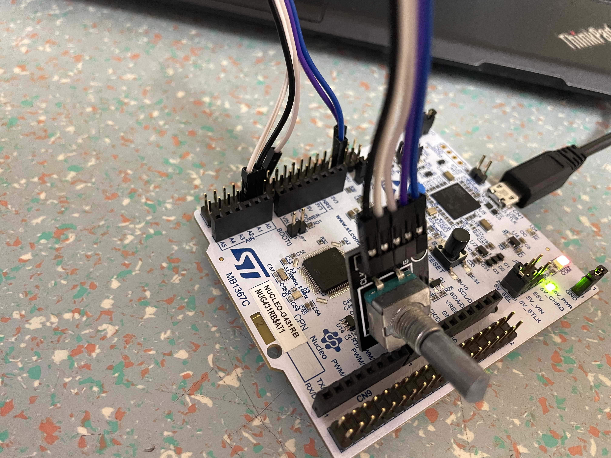

# Enkoder z STM32G4 Nucleo-64in TIM časovnikom 

## Cilj Naloge
S  pomočjo  programskega  okolja STM32CubeIDEin  HAL  knjižnicami  terSTMStudio (ali STM32CubeIDE  v Debug pogledu) sprogramirajte  mikroprocesor  tako,  da boste merili premike  in  hitrost vrtenja enkoderja.

## Postopek inicializacije periferije
| Funkcija: | TIM2_CH1  | TIM2_CH2  |
|-----------|-----------|-----------|
| Pin:      | ***PA1*** | ***PA2*** |
- Premakne se za **2** inkramenta.


## Pinout


## Vezje




## Video

https://user-images.githubusercontent.com/105905709/220463886-5f53d35d-2fb2-40e2-a635-9a0713d53d8c.mp4

## Komentar

V navodilih je napačno napisana koda, spodaj je popravljena.

```C
HAL_TIM_Encoder_Start_IT(htim2, TIM_CHANNEL_ALL);
void HAL_TIM_IC_CaptureCallback(TIM_HandleTypeDef *htim2) {}
stevec = __HAL_TIM_GET_COUNTER(htim2);
```
